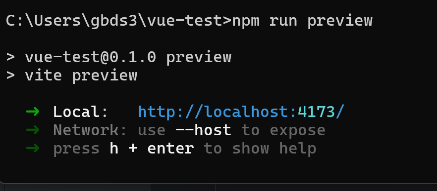
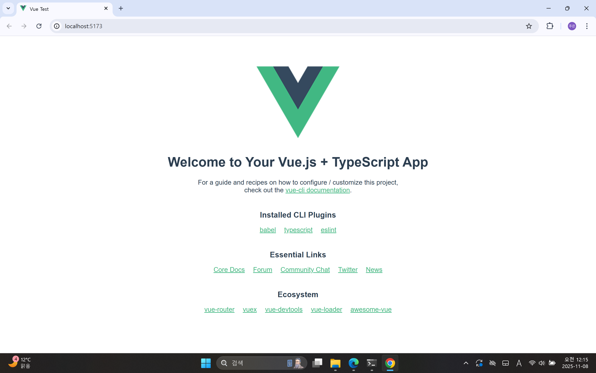

# vue-test
# Vue 2 → Vue 3 리팩터링

## 변경 요약
다음 파일들을 Vue 3 문법으로 변경함.

- `src/App.vue`
- `src/components/HelloWorld.vue`
- `main.ts`
- `tsconfig.json`
- `vite.config.ts`

구체적으로 다음과 같은 변경이 있음.
- Options API(`export default {}`)를 Composition API(`<script setup>`)로 변경
- `vue-cli` 환경에서 `vite` 기반으로 전환
- `vue.config.js` 대신 `vite.config.ts` 사용
- `npm run serve` 대신 `npm run dev`로 실행 방식 변경
- `@vitejs/plugin-vue` 추가로 .vue 파일 빌드 가능하도록 수정
- TypeScript 호환을 위해 `env.d.ts` 추가

## 실행 화면




## 실행 방법

## Project setup
```
npm install
```

### Compiles and hot-reloads for development
```
npm run serve
```

### Compiles and minifies for production
```
npm run build
```

### Lints and fixes files
```
npm run lint
```

### Customize configuration
See [Configuration Reference](https://cli.vuejs.org/config/).
